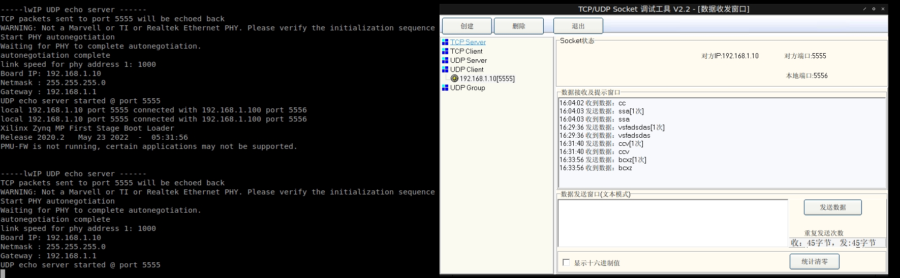

* * *
# tcp echo

vitis 2020.2 的echo模板, 板子显示


pc和板子对接, 不会dhcp分配, ip就是默认的192.168.1.10

pc上telnet访问
```
telnet 192.168.1.10 7
```


这里escape是ctrl+]


* * *
# udp echo

从tcp echo修改而来的一个单一功能版本的udp echo

