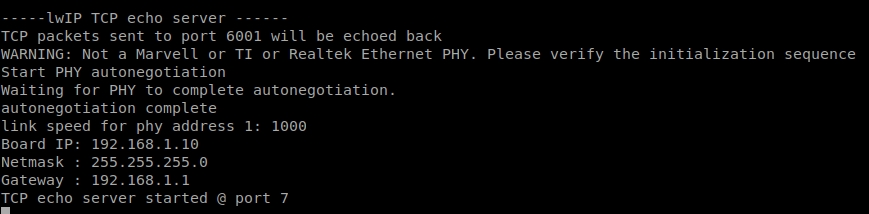
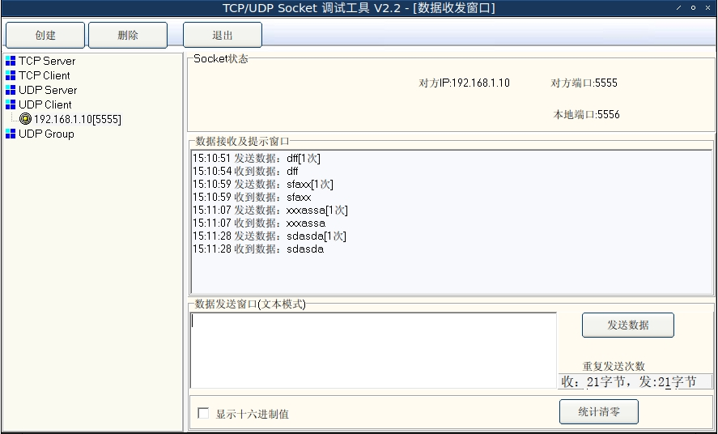

* * *
# tcp echo

vitis 2020.2 的echo模板, 板子显示



pc和板子对接, 不会dhcp分配, ip就是默认的192.168.1.10

pc上telnet访问
```
telnet 192.168.1.10 7
```


这里escape是ctrl+]


* * *
# udp echo



ok! 现在急需这玩意, 后续列到TODO

* * *
# TODO

## port libmfs from SDK 2018.2 to Vitis 2020.2

xilmfs is depecrated starting from 2019.1. Please use xilffs instead.

See commit here

<https://github.com/Xilinx/embeddedsw/commit/c470ed880028fb083fffa1a271ec2ee7797e0feb#diff-b3a135821a233a0fb67ff810b1298c23>

## port socket app in xapp1306

