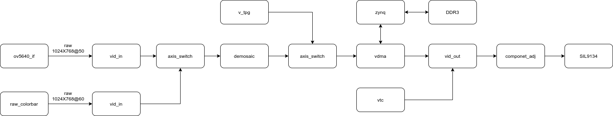
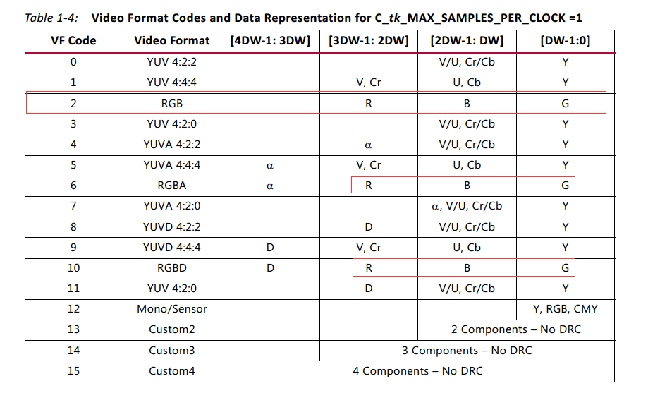

1. open vivado
2. in the tcl shell, cd to vivado folder
3. in the tcl shell, source create_proj.tcl
4. build vivado project
5. export hdf to sdk/hdf folder
6. open xsct shell, cd to sdk folder
7. source create_SW_proj.tcl

# ov5640_raw_vdma_hdmi

这个工程是1024x768@50fps 的 RAW DVP-10 输入

在针对raw数据使用demosaic或者cfa这样的ip进行插值之后，发现RGB分量顺序的GB分量是反的

经查ug934，Table 1-4，LSB分量是G，然后是B，R，依次到最高分量

结论，按手册，其实axis都符合这样的定义。这个和 native stream 不太一样，需要注意。

那么推理是在经过 vid_out 转换成 native stream 之后调整分量，不需要在[3DW-1: 2DW] [2DW-1: DW]之间交换。

其次，分量的位宽

这里进去就通过vid_in_axis丢弃低两位，这样axis通路所有分量都是8位宽，省事。

如果非要比如设置10bit分量位宽，那么需要在axis通路留意分量位宽。另外是vid_out_axis设置正确的native分量位宽。否则显示异常。

## 分析PLL配置,如图

input clock =24Mhz, PCLK = 72Mhz

0x3037[3:0]='d3,

24MHz/3 = 8MHz

0x3037[7]='b0,

0x3036[6:0]='d90,

0x3037[7] ? 0x3036[7:1]*2 : 0x3036[6:0]

8MHz * 90 = 720MHz

0x3035[7:4]='d1,

keeps 720MHz

0x3037[4]='b1

720MHz /2 = 360MHz

0x3034[3:0]=0xA

360MHz /2.5 = 144MHz

0x3108[5:4]=0

keeps 144MHz

0x300e[7:5]='d2

0x3035[3:0]=1

144MHz /2=72MHz

0x460c[1]='b1

0x3824[4:0]='d2

keeps 72MHz

