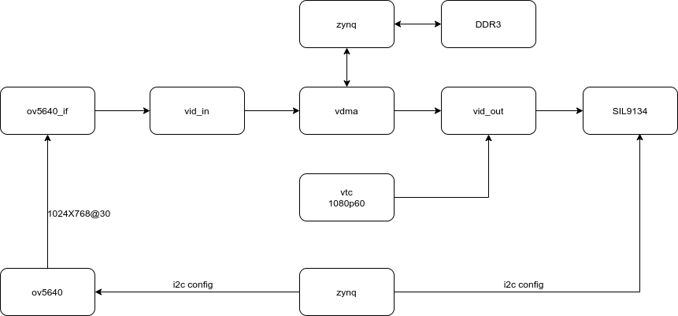
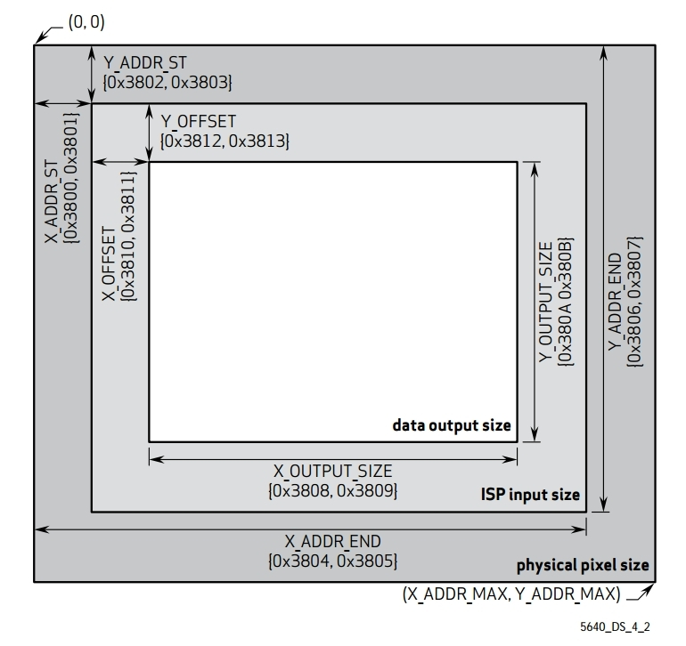
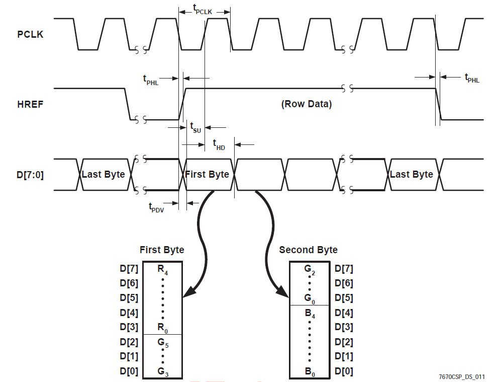

1. open vivado
2. in the tcl shell, cd to vivado folder
3. in the tcl shell, source create_proj.tcl
4. build vivado project
5. export hdf to sdk/hdf folder
6. open xsct shell, cd to sdk folder
7. source create_SW_proj.tcl

# ov5640_rgb565_vdma_hdmi

On AX7021 board, a single OV5640 cmos sensor config as RGB565 DVP at resolusion of 1024x768， buffered by vdma， regerates 1024x768@60fps timing then output to hdmi.

在AX7021开发板，接入单个OV5640摄像头，配置为1024x768的RGB565输入，然后通过vdma缓存之后重建1024x768@60fps时序输出到hdmi。

## 注意：

根据ug934，Table 1-4，LSB分量是G，然后是B，R，依次到最高分量

ov5640 config study

## 分析PLL配置,如图

input clock =24Mhz, PCLK = 72Mhz

0x3037[3:0]='d3,

24MHz/3 = 8MHz

0x3037[7]='b0,

0x3036[6:0]='d90,

0x3037[7] ? 0x3036[7:1]*2 : 0x3036[6:0]

8MHz * 90 = 720MHz

0x3035[7:4]='d1,

keeps 720MHz

0x3037[4]='b1

720MHz /2 = 360MHz

0x3034[3:0]=0xA

360MHz /2.5 = 144MHz

0x3108[5:4]=0

keeps 144MHz

0x300e[7:5]='d2

0x3035[3:0]=1

144MHz /2=72MHz

0x460c[1]='b1

0x3824[4:0]='d2

keeps 72MHz

## 分析PCLK和分辨率帧率

physical pixel size(active array size)：2592x1944

ISP window是2623x1943

0x3800=0x00,0x3801=0x00

X_ADDR_ST=0

0x3802=0x00,0x3803=0x04

Y_ADDR_ST=4

0x3010=0x00,0x3811=0x10

X_OFFSET=10

0x3012=0x00,0x3813=0x06

Y_OFFSET=6

0x3804=0x0a,0x3805=0x3f

X_ADDR_END=2623

0x3806=0x07,0x3807=0x9b

Y_ADDR_END=1947

data out size是1024x768

这里demo的有效分辨率1024x768, 总的timing size是2570x980，由于2pclk对应一个pixel

所以timing window是1285x980

摄像头配置帧率是fps=72000000/（2570x980）=28.59，还不到30fps