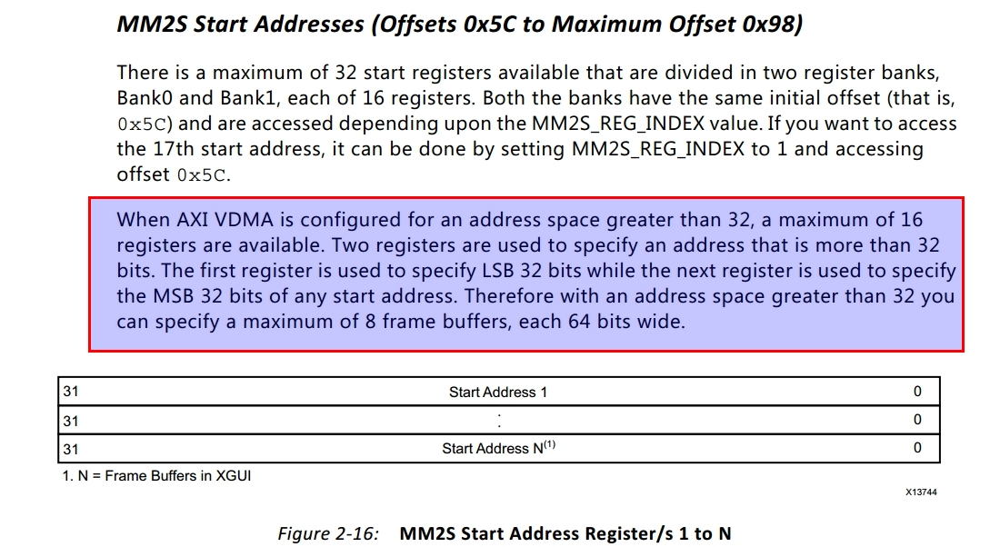
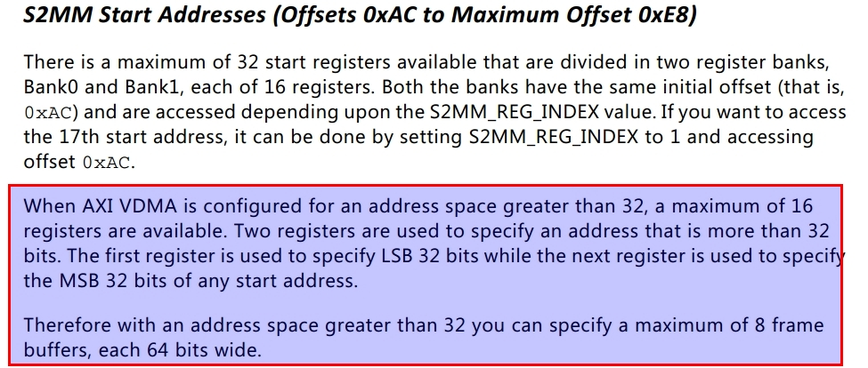

# vdma 64bit mode demo
pg020





# Board info
```
Zynqmp device: xczu3eg-sfvc784-1-i
DDR: MT40A512M16LY-062E x4 2400Mbps (total 4GB-64bit)
Quad-SPI FLASH: MT25QU256ABA1EW9 x1
```

# MAX96717 vs MAX96717F
717 support GMSL2 up to 6Gbps，717F only support GMSL2 3Gbps


# block design

[doc/system.pdf](doc/system.pdf)

[doc/xgpio_i2c_0.pdf](doc/xgpio_i2c_0.pdf)


# clocking

tx:
```
aixs_clk*bpp*ppc>=lane_rate*lane_num>=width*hight*fps*bpp
aixs_clk1>=width*hight*fps/ppc
lane_rate>=width*hight*fps*bpp/lane_num
aixs_clk2>=lane_rate*lane_num/(bpp*ppc)=width*hight*fps/ppc
lane_rate<=aixs_clk*bpp*ppc/lane_num
```

rx:
```
width*hight*fps*bpp<=lane_rate*lane_num<=aixs_clk*bpp*ppc
lane_rate>=width*hight*fps*bpp/lane_num
aixs_clk>=lane_rate*lane_num/(bpp*ppc)>=width*hight*fps/ppc
lane_rate<=aixs_clk*bpp*ppc/lane_num
```


