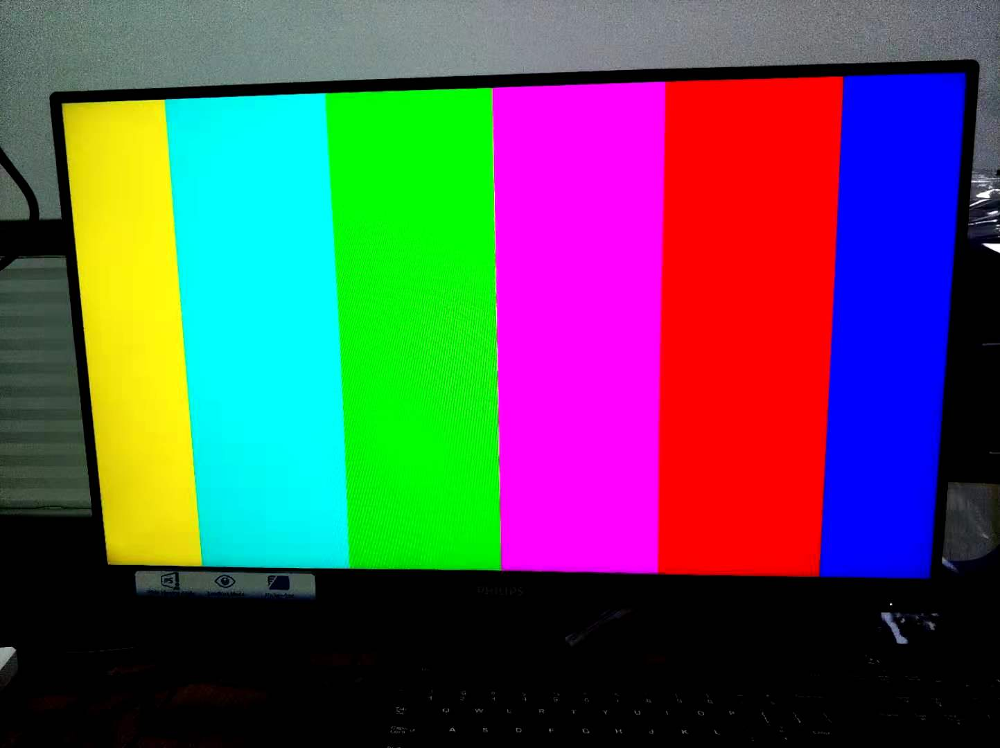

1. open vivado
2. in the tcl shell, cd to vivado folder
3. in the tcl shell, source create_proj.tcl
4. build vivado project
5. export hdf to sdk/hdf folder
6. open xsct shell, cd to sdk folder
7. source create_SW_proj.tcl

# vdma_crop

crop center 1280x720 from 1920x1080@rbg888

这里设置取1920x1080@rbg888中心的1280x720

