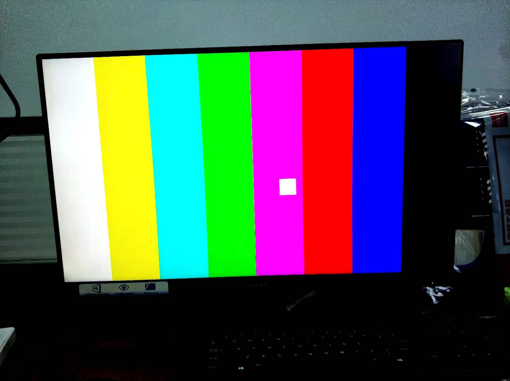

1. open vivado
2. in the tcl shell, cd to vivado folder
3. in the tcl shell, source create_proj.tcl
4. build vivado project
5. export hdf to sdk/hdf folder
6. open xsct shell, cd to sdk folder
7. source create_SW_proj.tcl

# block diagram

On AX7021 board， generates 1080p test patterns and buffered to ddr by vdma, then output to hdmi. tpg config as 1080p(osd moving box) formats with rgb888, vtc config as 1080p60. Sil9134 config as rgb888 in with seperate syncs rgb888 out

在AX7021开发板，产生1080p测试图样，通过vdma缓存到ddr，然后输出到hdmi，所有格式都是RGB888。

This result matches tpg colorbar config.

