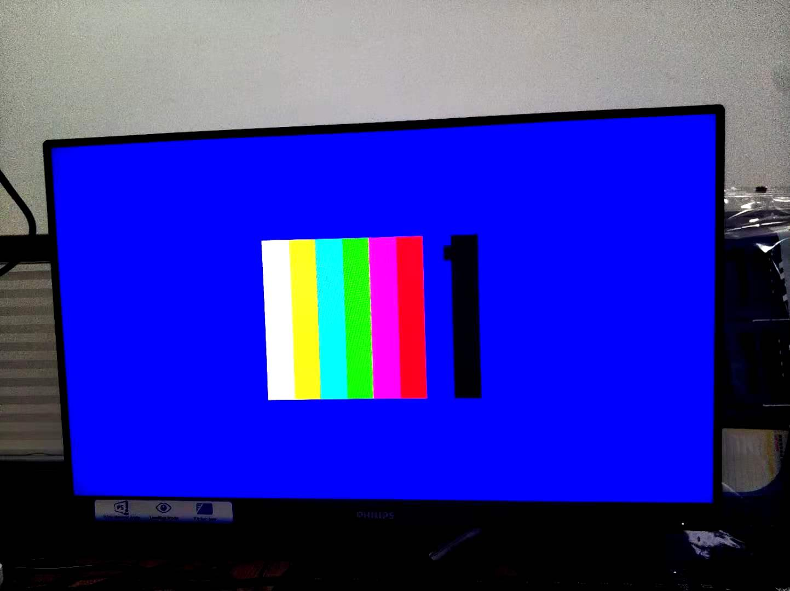
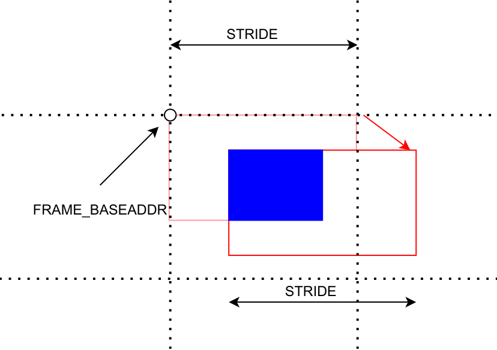

1. open vivado
2. in the tcl shell, cd to vivado folder
3. in the tcl shell, source create_proj.tcl
4. build vivado project
5. export hdf to sdk/hdf folder
6. open xsct shell, cd to sdk folder
7. source create_SW_proj.tcl

# vdma_pip

640x480@rbg888 colorbar in center of 1920x1080

这里设置取640x480@rbg888位于蓝色1920x1080中心位置

注意

1. 直接写DDR需要关闭cache

2. 注意STRIDE和HSIZE

## 分析

写入

写入时候的内存行间隔(STRIDE)对读出时候的内存行间隔有直接关联，这个demo取最简单的相等

读出

最终有效的读出区域就是绿色框的部分

最终水平位置

和offset0和offset1都有关系，这个demo里offset0都已经给定在了原点算起的中央位置，那么读出来的时候offset1就可以是0

offset1的是正数图像左移，是负数图像右移

